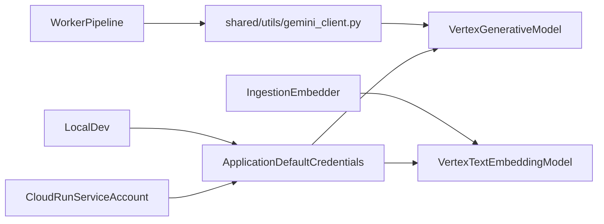

# Vertex-Only Migration Plan

## Goal
Switch the project from dual Gemini auth modes to **Vertex AI only**, eliminating Google AI Studio API key usage (`GEMINI_API_KEY`) from runtime code, ingestion paths, deploy recipes, and docs.

## Current State (from codebase review)
- Dual-mode generation is implemented in [`/Users/admin/Documents/hunt.ai/shared/utils/gemini_client.py`](/Users/admin/Documents/hunt.ai/shared/utils/gemini_client.py) using `GEMINI_USE_VERTEX` toggle.
- Settings still expose AI Studio key + toggle in [`/Users/admin/Documents/hunt.ai/shared/config/settings.py`](/Users/admin/Documents/hunt.ai/shared/config/settings.py).
- Google embeddings use `google.generativeai` + API key in [`/Users/admin/Documents/hunt.ai/services/ingestion/google_embedder.py`](/Users/admin/Documents/hunt.ai/services/ingestion/google_embedder.py).
- Dashboard uses manual Gemini API key input and `google-generativeai` in [`/Users/admin/Documents/hunt.ai/scripts/dashboard/app.py`](/Users/admin/Documents/hunt.ai/scripts/dashboard/app.py).
- Docs/deploy still instruct passing `GEMINI_API_KEY` in [`/Users/admin/Documents/hunt.ai/README.md`](/Users/admin/Documents/hunt.ai/README.md) and [`/Users/admin/Documents/hunt.ai/.claude/skills/deploy/SKILL.md`](/Users/admin/Documents/hunt.ai/.claude/skills/deploy/SKILL.md).

## Migration Design

## Implementation Steps
1. **Make Vertex auth mandatory in config and shared client**
- Update [`/Users/admin/Documents/hunt.ai/shared/config/settings.py`](/Users/admin/Documents/hunt.ai/shared/config/settings.py):
  - Remove `gemini_api_key` and `gemini_use_vertex` settings.
  - Keep `gcp_project_id` + `gcp_region` as required Vertex init inputs.
- Refactor [`/Users/admin/Documents/hunt.ai/shared/utils/gemini_client.py`](/Users/admin/Documents/hunt.ai/shared/utils/gemini_client.py):
  - Remove `_get_aistudio_model()` and all `google.generativeai` usage.
  - Keep one Vertex code path (`vertexai.init(...)`, `GenerativeModel(...)`).
  - Update error messages to ADC/service-account guidance only.

2. **Migrate ingestion embeddings off API key path**
- Replace AI Studio embed implementation in [`/Users/admin/Documents/hunt.ai/services/ingestion/google_embedder.py`](/Users/admin/Documents/hunt.ai/services/ingestion/google_embedder.py) with Vertex embeddings client.
- Keep existing `EMBEDDING_BACKEND=google` semantics if desired, but make it Vertex-backed.
- Validate output dimensions remain compatible with current Qdrant collection expectations.

3. **Align worker and dashboard consumers with Vertex-only auth**
- Verify worker modules that call `get_gemini_model()` continue working unchanged after the shared-client refactor:
  - [`/Users/admin/Documents/hunt.ai/services/worker/query_understanding.py`](/Users/admin/Documents/hunt.ai/services/worker/query_understanding.py)
  - [`/Users/admin/Documents/hunt.ai/services/worker/generation.py`](/Users/admin/Documents/hunt.ai/services/worker/generation.py)
  - [`/Users/admin/Documents/hunt.ai/services/worker/citation_verifier.py`](/Users/admin/Documents/hunt.ai/services/worker/citation_verifier.py)
- Refactor dashboard Gemini generation in [`/Users/admin/Documents/hunt.ai/scripts/dashboard/app.py`](/Users/admin/Documents/hunt.ai/scripts/dashboard/app.py):
  - Remove sidebar Gemini API key input.
  - Route generation through Vertex auth (ADC) and revise help text.

4. **Clean dependency surface and env templates**
- Remove `google-generativeai` where no longer needed; ensure `google-cloud-aiplatform` is present in runtime and dashboard requirements.
- Update env template in [`/Users/admin/Documents/hunt.ai/.env.local`](/Users/admin/Documents/hunt.ai/.env.local):
  - Remove `GEMINI_API_KEY` references.
  - Remove `GEMINI_USE_VERTEX` toggle and present Vertex as default/only mode.

5. **Update deployment and operational docs**
- Update [`/Users/admin/Documents/hunt.ai/README.md`](/Users/admin/Documents/hunt.ai/README.md) Quick Start + env docs:
  - Replace AI Studio key setup with ADC instructions (`gcloud auth application-default login`) and Cloud Run service-account notes.
- Update deployment skill in [`/Users/admin/Documents/hunt.ai/.claude/skills/deploy/SKILL.md`](/Users/admin/Documents/hunt.ai/.claude/skills/deploy/SKILL.md):
  - Remove `--set-secrets GEMINI_API_KEY=...` and associated secret creation steps.
- Update any troubleshooting docs that mention API keys (e.g., query-test skill).

6. **Infrastructure/auth verification checklist**
- Confirm Terraform IAM and APIs already satisfy Vertex calls (currently includes `aiplatform.googleapis.com` + `roles/aiplatform.user` in [`/Users/admin/Documents/hunt.ai/infra/terraform/main.tf`](/Users/admin/Documents/hunt.ai/infra/terraform/main.tf)).
- Add explicit runtime validation steps to ensure service accounts have required permissions in target project(s).

7. **Validation plan before rollout**
- Local: run worker pipeline with ADC and verify query understanding, generation, and citation verification paths.
- Ingestion: run a small embedding batch and verify vector dimensions + Qdrant upsert success.
- Dashboard: run generation comparison flow without API-key input.
- Deploy smoke test: health endpoints + one end-to-end WhatsApp query in staging.

## Rollout Strategy
- Ship behind a short-lived compatibility branch with a single cutover PR.
- In staging, run parallel smoke tests for worker + ingestion before production deploy.
- Remove stale secret (`gemini-key`) after successful production verification to prevent accidental fallback.

## Risks and Mitigations
- **Embedding API mismatch (dimension/model behavior):** pin and test Vertex embedding model + dimension before bulk ingestion.
- **ADC misconfiguration in local/dev:** document exact local auth command and expected failure messages.
- **Silent dependency drift in dashboard scripts:** run dashboard-specific install/test path after dependency updates.